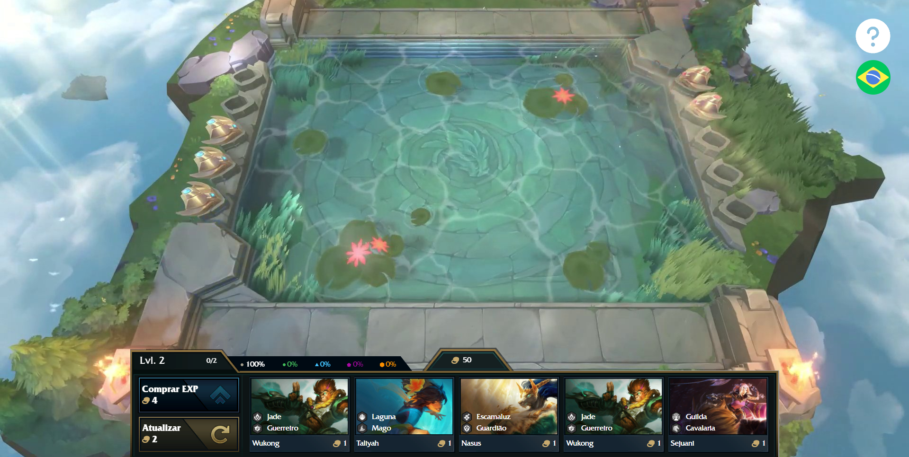

<h1 align="center">
    Rolldown Simulator
</h1>

Este é um simulador do jogo Teamfight Tactics (TFT) desenvolvido para web. Este é um projeto educacional, portanto, sem fins lucrativos e ainda é um projeto em desenvolvimento, portanto bugs ainda podem ser encontrados e novas funcionalidades podem ser inseridas a qualquer momento. O objetivo é ser o mais fiel possível do jogo oficial publicado pela Riot Games e todas as funcionalidades do Shop do TFT são as mesmas. 

### 📋 Teamfight Tactics

Para aqueles que não são familiares, TFT é um jogo de estratégia multiplayer, do gênero "Autochess" onde o seu objetivo é montar um exército poderoso de unidades para poder batalhar com outras 7 pessoas. Onde somente 1 se consagra vencedor. Essas unidades possuem habilidades e sinergias que lhe dão vantagens no jogo. O jogo é dividido por turnos e a cada turno você adquire 5 novas unidades além de ouro e experiência. Você pode gastar ouro para "roletar" outro set de 5 unidades aleatórias ou comprar experiência e aumentar o seu poder e as chances de virem unidades melhores nos seus "rolls".
Uma mecânica fundamental no jogo é o ato de roletar tudo (em inglês rolldown), ou parte, do seu dinheiro a fim de aprimorar suas unidades ou encontrar unidades novas mais poderosas para melhorar o seu exército. Embora este seja um momento crucial e decisivo no jogo, ele acontece poucas vezes por jogo e pelo TFT ser um jogo que recebe atualizações frequenttemente que mudam drásticamente a maneira como o jogo é jogado, é importante que você tenha alguma maneira de treinar os seus rolls. Foi com este objetivo que desenvolvi o Rolldown Simulator para que os jogadores possam praticar em um ambiente de testes sem sacrificar seus pontos de liga.

### 🔧 Como jogar

Campeões podem ser comprados clicando em seus ícones no shop, fazendo eles aparecerem em seu banco. Esses campeões comprados podem ser movidos, trocados de posição ou vendidos de volta pra loja para ganhar gold. Os botões no lado esquerdo podem ser usados para comprar EXP ou roletar os campeões da loja. O gold exibido é na realidade um input então você pode manualmente editar o seu valor. O mesmo vale para o level.
Todas as bindings (atalhos no teclado) do jogo original se mantém as mesmas nesta versão para web. Portanto, você pode utilizar a tecla "D" para roletar, "F" para comprar EXP ou "E" em cima de um campeão no seu banco para vendê-lo.

## 🛠️ Construído com

Esse projeto foi desenvolvido com as seguintes tecnologias:

- [Vite](https://vitejs.dev)
- [ReactJS](https://reactjs.org)
- [TypeScript](https://www.typescriptlang.org/)
- [Styled Components](https://styled-components.com)

## 💻 Demonstração

## 📄 Licença & Disclaimer

Este projeto está sob a licença MIT - veja o arquivo [LICENSE.md](LICENSE.md) para mais detalhes.

This project was intended for educational, non-monetary purposes and is in no way affiliated with Riot Games or Teamfight Tactics. All intellectual properties and assets belong to their respective owners. I'm grateful to Riot Games for being supportive of their developers by releasing these assets, and also for making my favorite games! :)

---
⌨️ com ❤️ por [Guilherme Spati](https://github.com/guispati) 😊